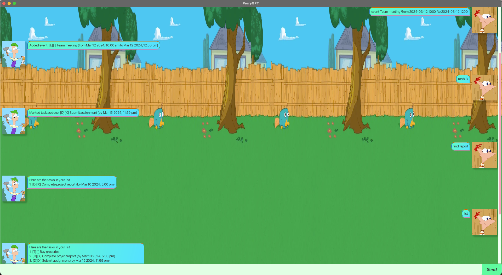

# PerryGPT User Guide


# An Introduction to PerryGPT
An all-in-one desktop app that acts as your task manager, displayed via a Graphical User Interface (GUI).
Get reminded of your childhood times watching the Phineas & Ferb cartoon! You will take on the role of 
Ferb, and Phineas will be your task manager! Try to spot Perry the Platypus in the background if you can!

## Quick Walkthrough

### 📌 Navigation
- ✨ [Quick Setup](#quick-setup)
- 🌟 [Features](#features)

### 🌟 Features
- 🚀 [Adding Tasks](#adding-tasks)
- 📋 [List All Tasks](#list-all-tasks)
- 🔍 [Find Tasks](#find-all-tasks-containing-a-keyword)
- ❌ [Delete Task](#delete-tasks)
- ✅ [Mark or Unmark Task](#mark-or-unmark-tasks)
- 🔚 [End Conversation](#end-conversation)


### Quick Setup
1. Install Java 17 or above on your computer.
2. Download the latest .jar file from GitHub.
3. Open a command terminal, go into the directory in which you have placed the jar file, and run: 
    ```sh
    java -jar perryGPT.jar

### Features

##### ⭐ Adding Tasks
You may ask Ferb to add 3 ty&nbsp pes of tasks for you:
1. Add a task with a description (**To-Do Task**)
   * Usage: `todo <task_description>`
   * Example: `todo buy groceries`
   * You should see a message from Ferb saying `Added task: [T][] buy groceries>`

2. Add a task with deadline and description (**Deadline Task**)
   * Usage: `deadline <task_description> /by <yyyy-MM-dd HHmm>`
   * Example: `deadline practice piano /by 2024-10-15 1923`
   * You should see a message from Ferb saying `Added deadline: [D][] practice piano (by Oct 15 2024, 7:23 pm)`

3. Add a task with a start and end time (**Event Task**)
   * Usage: `event <task_description> /from <yyyy-MM-dd HHmm> /to <yyyy-MM-dd HHmm>`
   * Example: `event Team meeting /from 2024-09-20 1000 /to 2024-09-20 1200`
   * You should see a message from Ferb saying `Added event: [E][] Team meeting (from Sept 20 2024, 10:00 am 
   to Sept 20 2024, 12:00 pm)`

#### ⭐ Update the start and end time of an Event Task
You may ask Ferb to update the start and end time of an Event task that is currently stored.
  * Usage: `updateevent <event_task_index> /from <new_from_date_and_time> /to <new_to_date_and_time>` 
  * Example: `updateevent 2 /from 2023-09-01 1000 /to 2023-09-01 1200`
  * You should see a message from Ferb saying `Updated event: [E][] <task_description> (from Sept 01 2023, 10:00 am 
  to Sept 01 2023, 12:00 pm)` 

#### ⭐ List all tasks
You may ask Ferb to list all the tasks currently stored
   * Usage: `list`
   * You should see a message from Ferb containing a list of all the tasks. 

#### ⭐ Find all tasks containing a keyword
You may ask Ferb to search for all tasks containing a specific keyword
   * Usage: `find`
   * You should see a message from Ferb with a list of all tasks containing that keyword

#### ⭐ Delete tasks
You may ask Ferb to delete a task by the task ID
   * Usage: `delete <task_id>`
   * Example: `delete 2`
   * You should see a message from Ferb to signal that the task has been deleted successfully.

#### ⭐ Mark or Unmark tasks
You may ask Ferb to mark or unmark task by the task ID
   * Usage: `mark <task_id>` or `unmark <task_id>` 
   * Example: `mark 2` or `unmark 3`
   * You should see a message from Ferb to signal that the task has been marked or unmark successfully.

#### ⭐ End conversation
You may ask Ferb to end the conversation with you. However, your application will continue to run.
   * Usage: `bye`
   * You should see a message from Ferb that bids farewell to you. 

🚀